## AWSへのデプロイ

AWSへのデプロイは、terraformとecspressoによって自動化されています。

### AWSへECSクラスターの生成
[terraform](./terraform/README.md) で説明しています。

### ECSクラスターへのデプロイ
[ecsへのデプロイ方法](./ecs/README.md) で説明しています。

# 構成図

# GITHUB Actionsのセットアップ
Githubリポジトリの管理画面で以下のSecretを作成してください。
- `AWS_ACCESS_KEY_ID`
  - `terraform show`の`iam_user_deployer.key_id`
- `AWS_SECRET_ACCESS_KEY`
  - - `terraform show`の`iam_user_deployer.secret`

